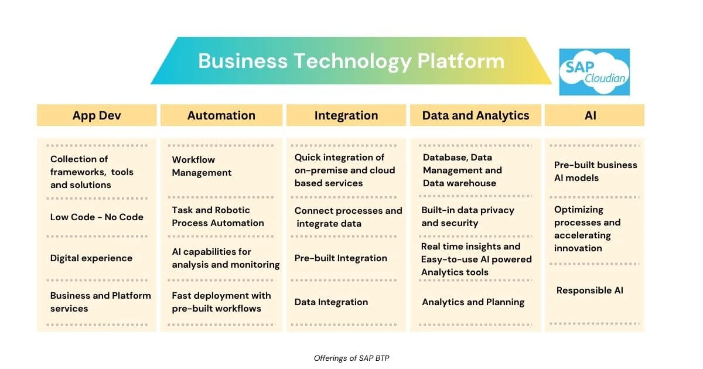
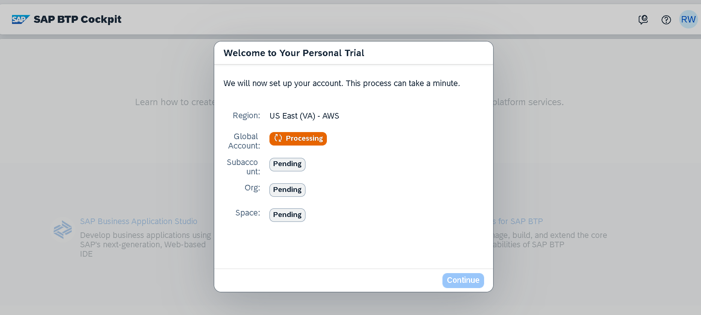
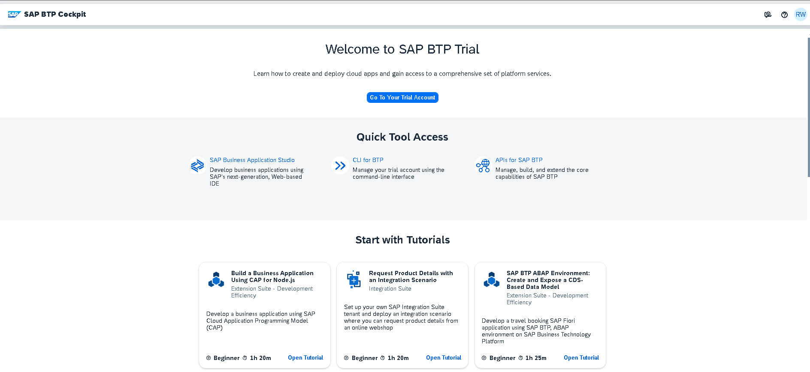
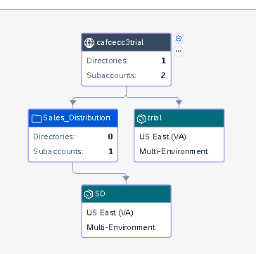
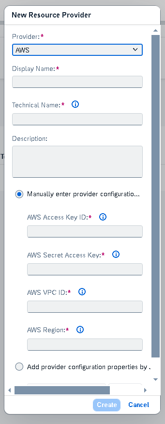
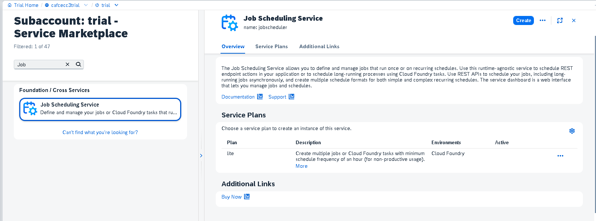
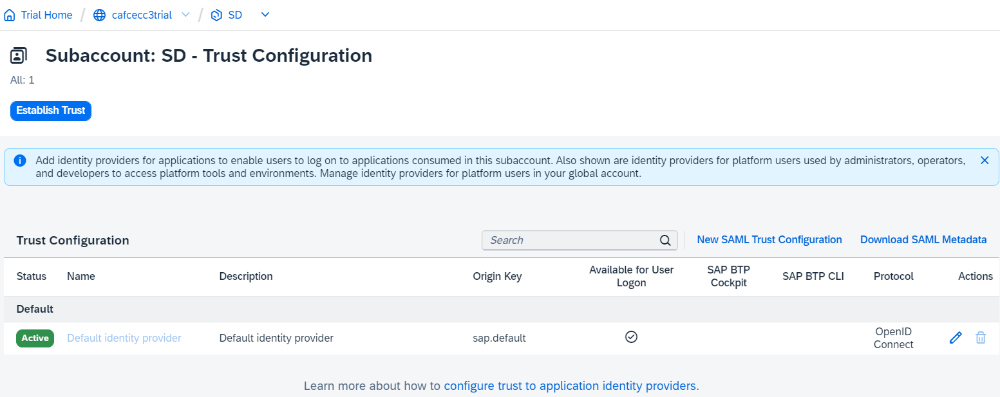
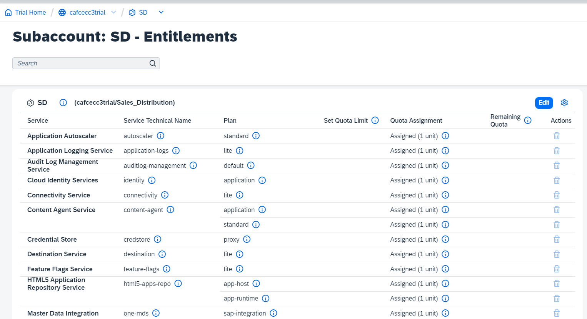
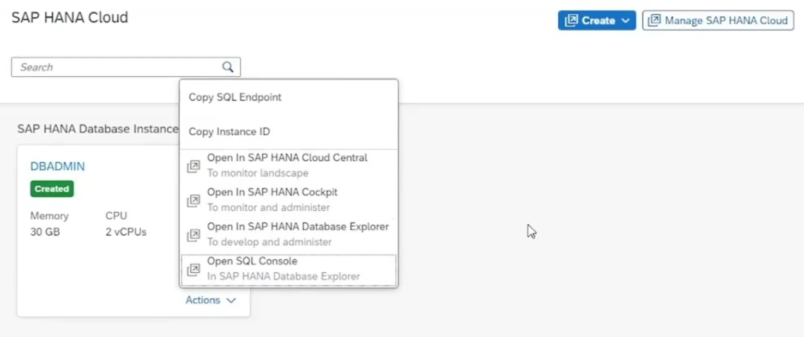
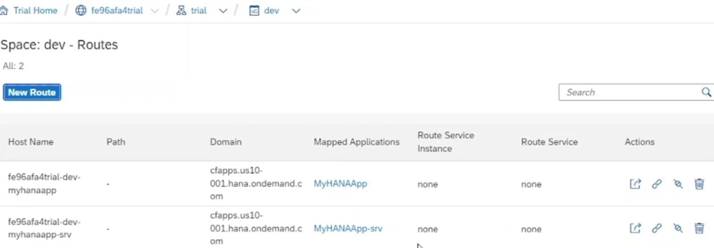

# SAP-BTP-Notes

This Repository contains notes on SAP BTP and important pointers 

# Intrduction to SAP BTP

## SAP BTP Introduction

Initially Cloud Platform was known as 'SAP Cloud Platform'. In 2021, SAP rebranded it to 'SAP BTP'.

    SAP BTP is a set of SAP Technologies that enables businesses to transform data into value

SAP BTP offers many solutions like databases, analytics, integration, programming tools & data warehouse

SAP BTP is basically a Platform as a Service (PaaS)

### Cloud Technology & need of Cloud Platform
### Offerings of SAP BTP

### Use-cases of SAP BTP

SAP BTP (Business Technology Platform) offers a wide range of use cases across various industries and business functions. Some of the common use cases include:

1. **Enterprise Application Development**: Organizations can use SAP BTP to develop custom enterprise applications tailored to their specific business needs. These applications can range from customer relationship management (CRM) systems to supply chain management (SCM) solutions, leveraging SAP's extensive set of development tools and frameworks.

2. **Integration and Data Interoperability**: SAP BTP enables seamless integration between SAP and non-SAP systems, as well as between on-premises and cloud applications. This allows businesses to streamline their processes, eliminate data silos, and ensure data consistency across different systems.

3. **Analytics and Business Intelligence (BI)**: With SAP BTP, organizations can leverage advanced analytics and BI capabilities to gain insights from their data. This includes predictive analytics, real-time reporting, and data visualization tools that help businesses make data-driven decisions and identify opportunities for optimization and growth.

4. **Internet of Things (IoT) Solutions**: SAP BTP provides IoT services for collecting, managing, and analyzing data from connected devices. This enables organizations to monitor and control their assets in real-time, optimize operational efficiency, and deliver new services and experiences to customers.

5. **Machine Learning and AI**: SAP BTP offers machine learning and AI services that enable businesses to automate repetitive tasks, personalize customer experiences, and improve decision-making processes. This includes capabilities such as natural language processing (NLP), image recognition, and predictive modeling.

6. **Supply Chain Optimization**: By leveraging SAP BTP's integration, analytics, and IoT capabilities, organizations can optimize their supply chain operations. This includes demand forecasting, inventory management, logistics optimization, and supplier collaboration, leading to improved efficiency and reduced costs.

7. **Customer Experience Enhancement**: SAP BTP enables businesses to deliver personalized and engaging experiences to their customers across multiple channels. This includes omnichannel commerce, marketing automation, and customer service solutions that help organizations build lasting relationships with their customers.

8. **Security and Compliance Management**: SAP BTP provides robust security and compliance features to protect sensitive data and ensure regulatory compliance. This includes identity and access management, data encryption, and audit trails that help organizations mitigate risks and maintain trust with their stakeholders.

The platform's flexibility and scalability make it suitable for a wide range of use cases in various industries. 
    

### Advantages of SAP BTP

SAP BTP (Business Technology Platform) offers several advantages that make it a compelling choice for organizations looking to accelerate their digital transformation efforts:

1. **Integrated Platform**: SAP BTP provides a comprehensive suite of tools and services for application development, integration, analytics, and more. This integrated approach allows organizations to build end-to-end solutions without the need for disparate systems or complex integrations.

2. **Scalability and Flexibility**: SAP BTP is built on a scalable and flexible architecture that can adapt to the evolving needs of businesses. Whether organizations are looking to deploy simple applications or complex enterprise solutions, SAP BTP can scale to meet their requirements.

3. **Speed of Innovation**: With SAP BTP, organizations can accelerate the development and deployment of applications by leveraging pre-built templates, reusable components, and ready-to-use services. This allows businesses to innovate faster and stay ahead of the competition.

4. **Reduced Total Cost of Ownership (TCO)**: By leveraging SAP BTP's cloud-based infrastructure and pay-as-you-go pricing model, organizations can reduce their upfront investment and ongoing maintenance costs. This enables businesses to achieve a lower total cost of ownership compared to traditional on-premises solutions.

5. **Seamless Integration with SAP Systems**: For organizations already using SAP solutions such as SAP S/4HANA or SAP ERP, SAP BTP offers seamless integration capabilities. This allows businesses to extend the value of their existing SAP investments and leverage their data and processes more effectively.

6. **Advanced Analytics and Insights**: SAP BTP provides powerful analytics and business intelligence capabilities that enable organizations to gain actionable insights from their data. Whether it's predictive analytics, real-time reporting, or data visualization, SAP BTP helps businesses make informed decisions and drive better outcomes.

7. **Enhanced Security and Compliance**: SAP BTP offers robust security features such as identity and access management, data encryption, and compliance controls. This helps organizations protect their sensitive data, mitigate security risks, and ensure regulatory compliance.

8. **Support for Emerging Technologies**: SAP BTP supports emerging technologies such as Internet of Things (IoT), machine learning, and artificial intelligence. This enables organizations to leverage these technologies to innovate and differentiate themselves in the market.

9. **Improved Customer Experience**: By building applications on SAP BTP, organizations can deliver personalized and engaging experiences to their customers across multiple channels. This includes omnichannel commerce, marketing automation, and customer service solutions that help businesses build lasting relationships with their customers.

Overall, SAP BTP offers a compelling set of advantages that enable organizations to drive digital transformation, innovate faster, and achieve better business outcomes. Whether it's improving operational efficiency, enhancing customer experiences, or unlocking new revenue streams, SAP BTP provides the tools and capabilities businesses need to succeed in today's digital economy.

### Services of SAP BTP

As of March 2024, there are 92 services available as part of SAP BTP
    https://discovery-center.cloud.sap/serviceCatalog

These services are for solutions like Application Development & Automation, Data & Analytics, Integration, Al etc.

Some important services are as follows :
+   - Cloud Foundry Runtime
   - SAP Business Application Studio (BAS)
   - SAP HANA Cloud
   - Workflow Management
   - Authorization and Trust Management

### Commercial Models of SAP BTP

-   SAP BTP Free Tier
    - Best for new ones to explore & hands-on development experience
    -   Free model but can easily upgrade to paid service plan

-   Pay-As-You-Go
    -   Commercial model; pay only for what you use
    -   Can sign up to start with no upfront cost & no minimum usage requirements

-   CPEA (Cloud Platform Enterprise Agreement)
    -   Commercial model; Consumption based where you pay in advance

-   Subscription
    -   Commercial model; select fixed set of services for a fixed rate, regardless of actual consumption

# SAP BTP Account Practicals

## Create SAP BTP Trial Account

Register into SAP website
1.  Navigate to sap.com and sign up using an email ID and specifiying your region
2. Navigate to SAP BTP Trial Account 

    SAP BTP Trial Account - https://account.hanatrial.ondemand.com/
3. Over there you will need to select region closest to you

4. Click on Go To Your Trial Account 

### Explore SAP BTP Cockpit

1.  Account Explorer
    -   Global Account Settings
    -   Create Sub Account & Directory

Directories and Subaccounts can be thought of as a file structure available in the OS. Where the Sub Accounts are the files.

Example Representation of the Sub Account:

2.  Resource Providers

Basically, SAP BTP allows to connect the global account to your provider account from a non SAP cloud vendor and consume remote service resources that you already own and which are supported by SAP through this channel, for example, if you are subscribed to AWS and have already purchased services such as PostgreSQL, then you can register the vendor as a resource provider in SAP BTP and consume this PostgreSQL service along with other services offered by SAP in your sub account.

3.  Boosters

"boosters" typically refer to packages or offerings that provide additional capabilities or resources to users or organizations using the platform. These boosters are designed to enhance the functionality, performance, or scalability of applications and solutions developed on SAP BTP. Boosters may include a combination of tools, services, and resources aimed at accelerating development, improving user experiences, or enabling new use cases.

The specific features and components included in a booster package can vary depending on the needs of the organization and the nature of the application being developed. 

BTP Boosters enable to quickly add associated services and subscriptions in one click to the account.

4.  System Landscape 

This provides an overview of the 

5.  Entitlements 
In SAP BTP (Business Technology Platform), "entitlements" refer to the permissions or rights granted to users or entities to access and use specific resources or services within the platform. These entitlements define what actions users are allowed to perform, what resources they can access, and under what conditions.

Entitlements in SAP BTP can vary depending on the type of service or resource being accessed. Some common examples of entitlements in SAP BTP include:

1. **Service Entitlements**: These specify which services within SAP BTP a user or entity has permission to access. For example, a user may be entitled to use SAP Analytics Cloud for data visualization and analytics or SAP Cloud Platform Integration for application integration.

2. **Resource Entitlements**: Resource entitlements define access rights to specific resources such as databases, storage, or compute instances within SAP BTP. For instance, a user may be entitled to deploy and manage a certain number of instances of SAP HANA database or SAP Cloud Foundry environment.

3. **Role-Based Entitlements**: Role-based entitlements define permissions based on the user's role or group membership. Users can be assigned roles with predefined sets of permissions that align with their responsibilities and job functions within the organization.

4. **Quotas and Limits**: Entitlements may also include quotas and limits that specify usage restrictions or thresholds for certain resources or services. For example, a user may be entitled to a certain amount of storage or a maximum number of API calls per month.

5. **License Entitlements**: In some cases, entitlements may refer to software licenses or subscriptions that grant users the right to use specific SAP BTP services or applications. These licenses typically come with terms and conditions that define usage rights, duration, and other constraints.

Entitlement management in SAP BTP is typically handled through the SAP BTP cockpit or administration console, where administrators can assign, modify, or revoke entitlements based on the organization's needs and policies. Effective entitlement management is crucial for ensuring proper access control, compliance with regulations, and efficient utilization of resources within SAP BTP.

6.  Usage Analytics

This shows the detailed usage analytics of the different sub accounts 

## Explore SAP BTP Subaccount

#### Overview
General Information, Cloud Foundry Environment

#### Cloud Foundry
In the context of SAP BTP (Business Technology Platform), Cloud Foundry refers to one of the runtime environments available for deploying and managing applications. SAP BTP supports multiple runtime environments, including Cloud Foundry and Neo.

Cloud Foundry within SAP BTP provides developers with a platform-as-a-service (PaaS) environment where they can build, deploy, and manage applications using a variety of programming languages and frameworks. It abstracts away infrastructure complexities and automates many aspects of application lifecycle management, such as scaling, monitoring, and logging.

Key features of Cloud Foundry within SAP BTP include:

1. **Polyglot Support**: Developers can use a wide range of programming languages and frameworks, including Java, Node.js, Python, Ruby, and more.

2. **Buildpacks**: Cloud Foundry uses buildpacks to detect, configure, and run applications. Buildpacks simplify the deployment process by providing a consistent way to package and deploy applications, regardless of the underlying technology stack.

3. **Container-based Architecture**: Applications deployed on Cloud Foundry within SAP BTP run in containers, providing a lightweight and portable runtime environment. This ensures consistency across different cloud environments and infrastructure providers.

4. **Self-Service Deployment**: Developers can deploy applications to Cloud Foundry within SAP BTP using a self-service model, without needing assistance from operations teams. This enables faster deployment cycles and greater agility in the development process.

5. **Scaling and High Availability**: Cloud Foundry within SAP BTP supports automatic scaling and high availability features, allowing applications to scale dynamically based on demand and ensuring continuous availability even in the event of failures.

6. **Service Marketplace**: Developers can access a marketplace of services within SAP BTP, including databases, messaging services, and more, which can be easily integrated with their Cloud Foundry applications.

Overall, Cloud Foundry within SAP BTP provides developers with a flexible and scalable platform for building and deploying cloud-native applications, helping organizations accelerate their digital transformation initiatives and drive innovation.

#### Kyma Environment
Kyma environment is a functionality provided by the SAP BTP. It's basically a fully managed cloud native Kubernetes application runtime based on the open source  project called Kyma. It's basically provide the capability to simplify the development and to run enterprise grade cloud native applications.

It also provides the functionality of serverless functions and much more.

#### Spaces in SubAccount 
In the context of a trial account in SAP BTP (Business Technology Platform), a "space" refers to a logical environment where applications, services, and related resources are organized and managed. When you sign up for a trial account or a paid subscription on SAP BTP, you are provided with a dedicated space where you can develop, deploy, and operate your applications.

Spaces in SAP BTP serve several purposes:

1. **Isolation**: Each space provides a level of isolation for resources and applications. This means that resources deployed in one space are logically separated from resources in other spaces, allowing for better organization and management.

2. **Collaboration**: Spaces enable collaboration among team members working on different projects or applications. You can invite other users to join your space, allowing them to contribute to development efforts or access resources as needed.

3. **Resource Management**: Spaces help you manage resources more effectively by providing a dedicated environment for deploying and monitoring applications. You can allocate resources such as memory, storage, and computing power to specific spaces based on the needs of your applications.

4. **Deployment Environment**: Each space serves as a deployment environment for applications developed on SAP BTP. You can deploy multiple applications within a single space, each with its own set of services and dependencies.

5. **Development Lifecycle**: Spaces support the development lifecycle by providing separate environments for development, testing, and production. You can deploy and test changes in a development space before promoting them to a production space to ensure stability and reliability.

Overall, spaces in SAP BTP help streamline the development and deployment of applications by providing a structured and isolated environment for managing resources and collaborating with team members. Whether you're building a small prototype or a complex enterprise application, spaces provide the flexibility and scalability you need to succeed in your development efforts.

#### Services - Service Marketplace, Instances & Subscriptions

The first option that we have is this service marketplace.
So this is basically a collection of services and it will hold all the services that are available for this sub account.

Services are basically the functionalities. So let's say you have an application where you want to run some background jobs. In ABAP we use we do SM36 / SM37 to create a background job and to manage them. But here in SAP BTP we don't have those options. So what we have.
We have services for those things.
So let's say for job scheduling, we have this job scheduling service.

If you go inside it, you can see the detail set.

A job scheduling service allows you to define and manage jobs that runs once or recurring schedules.

Job Scheduling Services

### Cloud Foundry

1. Spaces

In Cloud Foundry, "spaces" are logical environments within an organization where applications, services, and other resources are deployed and managed. They provide a way to organize and isolate resources for different purposes such as development, testing, staging, or production.

Here's a breakdown of the concept:

1. **Organization**: An organization is a top-level entity within Cloud Foundry that contains spaces. Organizations typically represent different teams, departments, or projects within a larger organization.

2. **Space**: A space is a subdivision within an organization where applications, services, and other resources are deployed and managed. Spaces provide isolation and control over resources within the organization. For example, you might have separate spaces for development, testing, staging, and production environments.

3. **Isolation**: Each space provides isolation from other spaces within the same organization. This isolation ensures that resources deployed in one space do not interfere with resources in another space. It allows teams to work independently without affecting each other's work.

4. **Resource Management**: Spaces allow organizations to manage resources such as applications, services, routes, and permissions within a specific context. This makes it easier to organize and manage resources based on their purpose or lifecycle stage.

Overall, spaces in Cloud Foundry provide a flexible and scalable way to organize and manage resources within an organization, enabling teams to work efficiently and securely in a multi-tenant environment.

2. Quota Plan 

In Cloud Foundry, a "quota plan" refers to a set of limits and constraints imposed on an organization or space to control resource usage. Quota plans are used to manage the allocation of resources such as memory, disk space, routes, and services within Cloud Foundry environments. They help ensure fair usage and prevent any single organization or space from consuming excessive resources, which could impact the overall performance and stability of the platform.

Here are some key aspects of quota plans in Cloud Foundry:

1. **Resource Limits**: Quota plans define limits on various resources such as memory, disk space, the number of routes, and the number of service instances that can be provisioned within an organization or space. These limits help prevent resource over-consumption and ensure that resources are distributed fairly among different users or teams.

2. **Usage Monitoring**: Cloud Foundry continuously monitors resource usage against the defined quota limits. If an organization or space exceeds its quota limits, Cloud Foundry may prevent further resource allocation until usage falls within the specified limits again.

3. **Quota Assignment**: Quota plans can be assigned to organizations or spaces within Cloud Foundry. This allows administrators to tailor resource allocation and usage limits based on the needs of different teams, projects, or departments.

4. **Flexibility**: Cloud Foundry typically provides flexibility in defining quota plans, allowing administrators to customize resource limits based on specific requirements. This flexibility enables organizations to optimize resource allocation according to their unique needs and priorities.

5. **Security and Stability**: By enforcing quota limits, Cloud Foundry enhances security by preventing resource exhaustion attacks and improves platform stability by ensuring that resources are distributed efficiently across different users and applications.

Overall, quota plans play a crucial role in resource management and governance within Cloud Foundry environments, helping organizations maintain control over resource usage while promoting fair and efficient allocation across various teams and projects.

3. Org Members

In Cloud Foundry, "org members" refer to users who have been granted access and permissions within an organization. An organization in Cloud Foundry is a top-level entity used to organize and manage spaces, applications, services, and other resources. Org members have various roles and permissions that determine their level of access and what actions they can perform within the organization.

Here's a breakdown of org members in Cloud Foundry:

1. **Roles**: Org members can have different roles within an organization, such as:

   - **Org Manager**: Org managers have full administrative access within the organization. They can manage spaces, applications, services, and other resources. They can also add or remove org members, create spaces, manage quotas, and perform other administrative tasks.
   
   - **Space Developer**: Space developers have permissions to manage applications and services within a specific space. They can push new applications, bind services, and perform other development-related tasks within their assigned spaces.
   
   - **Space Manager**: Space managers have permissions similar to space developers, but they can also manage other aspects of the space, such as managing routes, service instances, and user roles within the space.
   
   - **Org Auditor**: Org auditors have read-only access to the organization. They can view resources and activity within the organization but cannot make any changes.
   
2. **Permissions**: Depending on their roles, org members have different permissions to perform actions such as creating, updating, or deleting resources within the organization. These permissions help enforce security and control over the organization's resources.

3. **Collaboration**: Org members collaborate within the organization to develop, deploy, and manage applications and services. They work together in spaces to develop and test applications, share resources, and collaborate on projects.

4. **Access Control**: Org managers have the ability to manage org memberships, granting or revoking access to users as needed. This allows organizations to control who can access their resources and ensures that only authorized users have access to sensitive data and applications.

Overall, org members play a vital role in the collaborative development and management of applications and services within Cloud Foundry organizations. They are assigned roles and permissions that govern their access to resources and determine their level of involvement in organizational activities.

### HTML5 Applications

In the SAP Business Technology Platform (BTP) Cockpit, HTML5 applications refer to web applications developed using HTML, CSS, and JavaScript technologies. These applications are typically designed to run in web browsers and can be used to build various types of user interfaces and interactive experiences.

HTML5 applications in the BTP Cockpit are part of the larger landscape of application development and deployment capabilities provided by SAP. Here's how HTML5 applications fit into the BTP ecosystem:

1. **Development Environment**: BTP provides tools and services for developing HTML5 applications. Developers can use SAP Web IDE or other integrated development environments (IDEs) to create and edit HTML5 code, CSS stylesheets, and JavaScript logic.

2. **Deployment Options**: Once developed, HTML5 applications can be deployed and hosted on the SAP Cloud Platform, which is a core component of the SAP BTP. The Cloud Foundry environment within SAP Cloud Platform supports the deployment and scaling of HTML5 applications, allowing them to be accessed by users over the internet.

3. **Integration Capabilities**: HTML5 applications developed within the BTP ecosystem can integrate with other SAP and non-SAP services and systems. This includes accessing data from SAP S/4HANA, SAP SuccessFactors, SAP Business Warehouse, or any other system accessible through APIs.

4. **User Interface and Experience**: HTML5 applications are versatile and can be used to build various types of user interfaces, ranging from simple web forms to complex dashboards and analytics tools. They can incorporate responsive design principles to ensure optimal display on different devices and screen sizes.

5. **Security and Authentication**: BTP provides security features and authentication mechanisms to protect HTML5 applications and the data they interact with. This includes support for single sign-on (SSO), role-based access control, and encryption of sensitive data.

In summary, HTML5 applications in the BTP Cockpit represent a key aspect of application development and deployment, offering developers the flexibility to create modern web applications that can leverage SAP's cloud infrastructure and services.

### Connectivity
The Connectivity tab in the BTP Cockpit typically provides tools and features related to managing connectivity options for applications and services deployed on the SAP BTP.

### Destinations
Destinations: Destinations are configuration settings that define how applications deployed on the SAP BTP can connect to remote systems or services. These destinations can include URLs, credentials, and other parameters necessary for establishing connections. The Connectivity tab may provide an interface for creating, editing, and managing destinations.

### Cloud Connectors

Cloud Connectors are used to securely connect applications deployed on the SAP BTP to on-premises systems. They act as a bridge between the cloud environment and the on-premises systems, enabling seamless integration without exposing internal systems to the internet. The Connectivity tab may offer features for managing and monitoring cloud connectors.

### Security

#### Users
This tab shows all the users that are associated to the particular sub-account

#### Roles

Roles are a set of access controls that are provided to a user to be able to give certain access to them

#### Role Collections 

Role collections is a set of roles bunched together to make the role assignment easier for the admin

Here are a list of role collections which are available while adding a role collection to the user in any particular sub account:

1. Connector Administrator	- Operate the data transmission tunnels used by the Cloud Connector.	

2. Connectivity and Destination Administrator - Operate the data transmission tunnels used by the Cloud Connector and manage the destination configurations, certificates and subaccount trust.	

3. Destination Administrator - Manage the destination configurations, certificates and subaccount trust.	
4. Subaccount Administrator - Administrative access to the subaccount	
5. Subaccount Service Administrator - Administrative access to service brokers and environments on a subaccount level.	
6. Subaccount Viewer - Read-only access to the subaccount	

#### Trust Configuration 

Link to more details - https://help.sap.com/docs/btp/sap-business-technology-platform/trust-and-federation-with-identity-providers

#### Entitlements

In SAP Business Technology Platform (BTP), entitlements at the subaccount level refer to permissions or rights granted to a specific subaccount within the SAP BTP environment. A subaccount is a logical container within SAP BTP that can represent a department, project, or other organizational unit. Entitlements at the subaccount level govern access to services, resources, and functionalities within that specific subaccount.

Here are some key aspects of entitlements at the subaccount level:

1. **Service Access**: Entitlements determine which services and products are available for consumption within a particular subaccount. This includes platform services such as databases, application runtimes, integration services, analytics tools, and more.

2. **Quotas and Limits**: Entitlements may include quotas or limits on the usage of services and resources within the subaccount. These quotas specify the maximum amount of resources (such as memory, storage, or API calls) that can be consumed by applications or services deployed within the subaccount.

3. **Service Plans and Tiers**: Entitlements at the subaccount level may provide access to different service plans or tiers offered by SAP BTP. These plans can vary in terms of features, performance, and pricing. Users or applications within the subaccount may be entitled to specific service plans based on their requirements and entitlements.

4. **Access Control**: Entitlements control access to services and resources within the subaccount, ensuring that only authorized users or applications can utilize them. Access control mechanisms such as role-based access control (RBAC) or identity and access management (IAM) may be used to enforce security and compliance policies.

5. **License Management**: Entitlements at the subaccount level may be tied to software licenses or usage rights. License management ensures compliance with licensing agreements and helps organizations optimize their software usage and costs within each subaccount.

6. **Integration with Billing and Cost Management**: Entitlements at the subaccount level may be linked to billing and cost management features within SAP BTP. They help track resource usage, calculate costs, and manage billing for services consumed within each subaccount.

Overall, entitlements at the subaccount level provide granular control over access to services, resources, and functionalities within SAP BTP, allowing organizations to tailor permissions and manage usage based on the needs of specific departments, projects, or other organizational units.

## Explore SAP BTP Space

In short, SAP BTP spaces are logical partitions within an organization where applications, services, and resources are deployed and managed. They provide isolation, resource management, collaboration, and access control within the SAP BTP environment, allowing teams to work independently and efficiently.

### Deployed Applications

All the deployed applications via the CAP model from Bussiness Application Studio will be availabel here as applications in the space. 

Example of application in a space

### SAP HANA Cloud

Using this option at the application level within a space it is possible to create a SAP HANA Cloud instance

Here you can either create a 
1. SAP HANA Database
2. Data Lake

Example of SAP HANA Cloud Instance in 

### Routes

Basically, routes are the URLs that enable your end users to reach your application , this route section is not available under the Subaccount, so this is available only at the space level. So in order to manage the routes, we have to come under the space level and this section maintains the list of the mapped applications.

### Security Groups

It shows security related options at the space levels

### Events
### Space Members

## Create SAP HANA Cloud Instances
# CONTINUE HERE

### SAP HANA Database Instance and Data Lake Instance

### Manage SAP HANA Cloud instances (SAP HANA Cloud Central)

# Create, Build & Deploy 'Full-Stack Fiori Application' using CAP Model & SAP HANA Cloud.

## Understand CAP Model, Navigate to BAS to create Full-Stack Dev Space
## Create & Configure the CAP project 'e_Learning' and Prepare it for Development

## Understand important files of CAP Project – MTA, Package.json, Package-lock.json
## Create HANA Database Service Instance & Binding CAP Project to it
## Create Database(DB) Entities & Service Interfaces, Generate design-time DB artifacts
## Deploy design-time DB artifacts to HANA Cloud Database
## Explore SAP HANA DB Explorer & Load data into HANA Cloud DB tables
## Test CAP Service Entities locally by binding CAP project to DB service instance
## Create Fiori App List Report, Test it locally, Build & Deploy Fiori App & Test it in BTP (HTML5 App)
## Introduction to Approuter & XSUAA, Configure Approuter & Adding XSUAA Configuration
## Add Authorization to Application, Understand Authentication Vs Authorization
## Create Roles for Application, Generate Roles in xs-security file & Test it's impact on App
## Create Role Collection and assign Roles & Users to it.
## Introduction to POSTMAN & Configuration
## Working with POSTMAN to test Fiori Application (CRUD operations).

# Create SAP Fiori Application using
## Fiori Annotations
## Create & Configure the CAP project 'Fashion_Shop' and Prepare it for Development
## Create CDS View entity & use of syntax like Concatenation, Case etc...
## Create Service entity on tables & view; test the CAP services locally
## Add SAP Fiori Annotations to CAP project to create List Report Fiori Application
## Working on item detail page for List Report using annotations
## Enable OData Draft to perform Edit & Create operations & Explore Draft Tables
## Test Fiori Application locally to perform CRUD operations
## Create 'Value Help' & understand concepts like redirection target